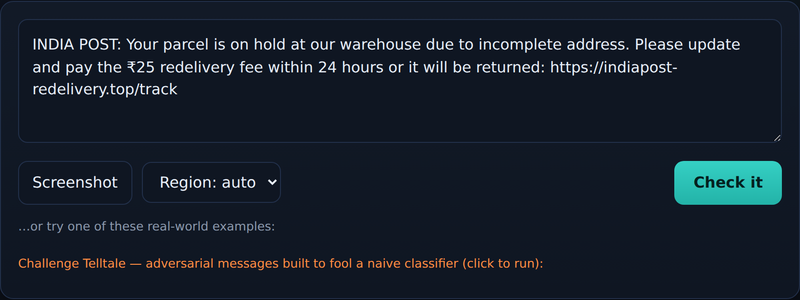
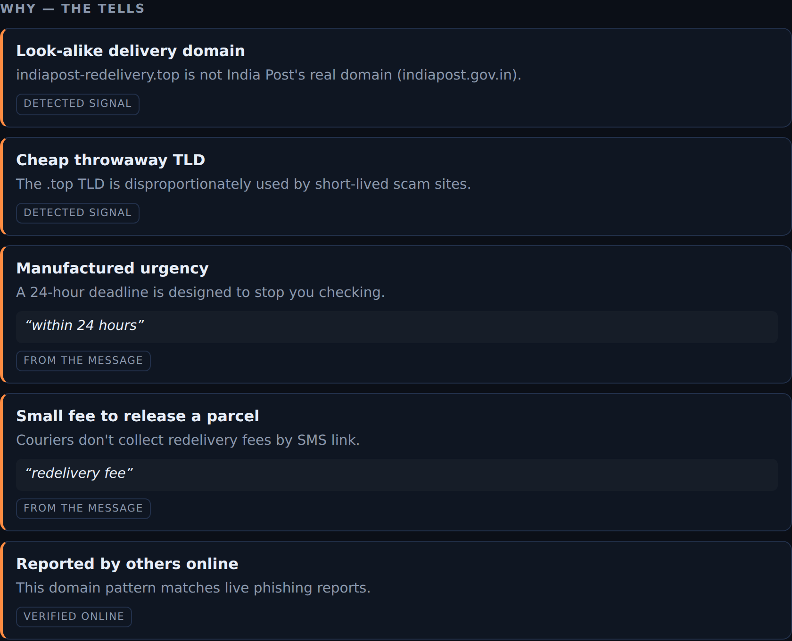
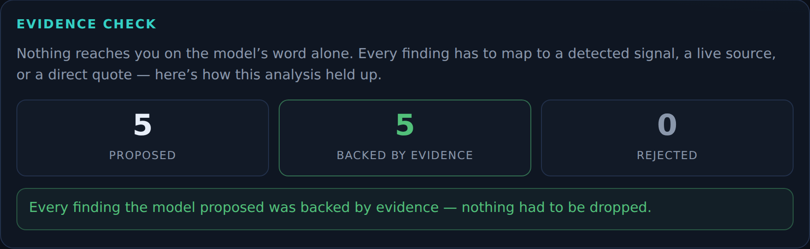

# Telltale

[](https://github.com/adityaalleshwaram508-sys/Telltale/actions/workflows/ci.yml)
&nbsp;[](LICENSE)
&nbsp;[](https://www.python.org/)

**An evidence-constrained fraud-analysis pipeline.** A language model may propose a
claim, but no claim reaches the user unless it can be grounded in the observed
input, a deterministic signal, or retrieved evidence — and the model can never
push the risk below what the hard evidence already justifies.

Reasoning: **NVIDIA Nemotron** on **Nebius Token Factory** · Live verification: **Tavily**

**Live demo:** https://telltale-jawt.onrender.com &nbsp;·&nbsp; **Demo video:** _add your YouTube link_ &nbsp;·&nbsp; **Architecture:** [`docs/ARCHITECTURE.md`](docs/ARCHITECTURE.md)

*Built for the 2026 Nebius × NVIDIA Global AI Hackathon.*

---

## How it works, in one picture

```text
             PROOF
               │
               ▼
        ┌──────────────┐
        │   TELLTALE   │
        └──────┬───────┘
               │
       ┌───────┴────────┐
       │                │
  HARD EVIDENCE     NEMOTRON
       │                │
       └───────┬────────┘
               ▼
        LIVE VERIFICATION
               │
               ▼
        CLAIM VERIFIER
               │
       ┌───────┴────────┐
       │                │
    ACCEPT           REJECT
       │                │
       └───────┬────────┘
               ▼
        AUDITABLE VERDICT
```

**Hard evidence** — deterministic detectors (look-alike domains, payment rails, urgency, prompt-injection) that set a risk floor. **Nemotron** — Nano + Super on Nebius Token Factory, doing the reasoning. **Live verification** — Tavily against current reports. The **claim verifier** admits a finding only if it maps to a real signal, a returned source, or a verbatim quote; anything else is rejected. The output is an **auditable verdict** — every claim traceable to its evidence, every rejection shown.

## How it meets the hackathon brief

| Requirement | How |
| --- | --- |
| Runtime call to **Nebius Token Factory** | every reasoning step calls the Token Factory inference API at runtime — [`backend/llm.py`](backend/llm.py) |
| **NVIDIA open-source model** | NVIDIA Nemotron 3 (Nano + Super) does all reasoning |
| Functional **Tavily** call | live verification runs a real Tavily search at runtime — [`backend/tavily.py`](backend/tavily.py) |
| **Open source** | MIT — [`LICENSE`](LICENSE), public repo |
| **Working demo** | https://telltale-jawt.onrender.com |
| **Demo video** | _add your YouTube link_ |

---

## The 30-second demo

Paste a suspicious message, link, or screenshot. Telltale returns a 0–100 risk
score, the specific tells behind it, the scam archetype with a cited source, an
action plan, and regional reporting channels. Before any of that, it shows an
**Evidence check**: how many findings the model proposed, how many the evidence
backed, and any it rejected — with the reason each rejected claim was dropped.

```bash
python -m pytest -q          # 40 unit tests
python eval/detection.py     # detection metrics (no API key needed)
python eval/grounding.py     # Evidence Integrity Benchmark (no API key needed)
```

## What it looks like

**1. Input** — paste a suspicious message, link, or screenshot, or try a built-in example (including the adversarial "Challenge Telltale" set).



**2. Evidence** — every tell is bound to a detected signal, a live Tavily source, or a direct quote.



**3. Verification** — the Evidence check on every result: how many findings the model proposed, how many the evidence backed, and any it couldn't (rejected, with the reason). Here all five were backed; the verifier's rejection behaviour is measured reproducibly in the [Evidence Integrity Benchmark](docs/EVALUATION.md).



## Why this is different

Reported consumer fraud losses hit **$12.5 billion in the US alone in 2024**, up
25% in a single year ([FTC](https://www.ftc.gov/news-events/news/press-releases/2025/03/new-ftc-data-show-big-jump-reported-losses-fraud-125-billion-2024)).
The instinctive fix — ask an LLM "is this a scam?" — is risky, because a confident
**wrong** answer is worse than none: a model can invent a government helpline, call
a real domain malicious without checking, or quote a rule it never verified.

Scam detection is the application; **evidence-constrained inference** is the
contribution. Telltale treats the model as a *proposer*, not an authority.
Detection, reasoning, evidence, and verification are separate stages, and a
verification layer sits between the model and the user.

## Evidence-constrained inference

The system holds one invariant:

> Every *tell* in the final verdict must reference exactly one piece of evidence —
> a deterministic **signal**, a returned **source**, or a verbatim **quote** from
> the input — and that reference must check out.

[`backend/verify.py`](backend/verify.py) enforces it:

* a tell citing a signal must cite a signal id the detectors actually produced;
* a tell citing a source must cite a source id research actually returned;
* a tell quoting the message must quote text that actually appears in it.

Anything else is dropped and recorded as a rejected claim. Separately,
`reconcile_verdict` clamps the model's score into `[floor, 100]`, where `floor` is
set by the deterministic detectors — so a message full of severe signals can never
be returned "safe," regardless of what the model says. Rejected claims are
surfaced in the UI so the verifier's decision can be inspected during a run.

## Live example

Input (an SMS):

```
INDIA POST: Your parcel is on hold due to incomplete address. Pay the ₹25
redelivery fee within 24 hours or it will be returned: https://indiapost-redelivery.top/track
```

Pipeline:

1. **Deterministic detectors** flag a look-alike/brand-mismatched domain, a
   suspicious TLD, and urgency language, and set a risk floor.
2. **Nemotron Nano** extracts entities and message context; **Nemotron Super**
   classifies the archetype (delivery/courier phish).
3. **Tavily** checks the domain and claims against live reports.
4. **Nemotron Super** synthesises a verdict; **`verify.py`** drops any tell it
   can't ground and clamps the score to the floor.

Result: `HIGH · 78/100`, every tell bound to a signal, a source, or a quote, and
an Evidence check panel showing what the model proposed versus what survived.

## Architecture

```text
        ┌── screenshot ─► MiniCPM-V (transcribe) ─┐
input ──┤── link ──────────────────────────────────►│
        └── text ──────────────────────────────────►│  message text
                                                     ▼
                          deterministic detectors (code)  ─► signals + risk FLOOR
                                                     │
              Nemotron Nano ── context ─────────────┤
              Nemotron Super ── classify ───────────┤  (archetype ∈ curated catalogue)
                                                     │
                          Tavily ── live research ──► sources
                                                     │
              Nemotron Super ── verdict (tells bound to signal/source/quote)
                                                     │
                      verify.py ── drop unsupported tells · clamp score to floor
                                                     │
              Nemotron Super ── action plan + report channels (curated KB)
                                                     ▼
                                             AnalysisResult
```

Each stage is separable and testable, and every model stage degrades to a
deterministic path (with a coverage note) rather than failing, so the app **fails
closed** — it never invents to fill a gap. Full write-up:
[`docs/ARCHITECTURE.md`](docs/ARCHITECTURE.md).

## Why Nemotron + Nebius

Every reasoning step is a runtime call to **Nebius Token Factory's**
OpenAI-compatible endpoint, using **NVIDIA Nemotron 3**:

| Stage                 | Model                                   | Why                              |
| --------------------- | --------------------------------------- | -------------------------------- |
| Screenshot OCR        | `openbmb/MiniCPM-V-4_5`                 | vision transcription             |
| Message understanding | `nvidia/NVIDIA-Nemotron-3-Nano-30B-A3B` | fast, cheap structured extraction|
| Classification / verdict / actions | `nvidia/nemotron-3-super-120b-a12b` | reasoning + long context |

The Nano/Super split keeps the frequent extraction calls fast and cheap while
reserving the larger model for the reasoning-heavy steps. Token Factory has no
Nemotron vision model, so screenshot transcription uses MiniCPM-V; **nothing that
decides the verdict runs on a non-Nemotron model.** Model IDs are configurable in
[`backend/config.py`](backend/config.py); these defaults are what the app calls at
runtime.

## Live verification with Tavily

When a message contains something checkable, Telltale runs a live Tavily search
and treats the results as cited evidence — never as automatic proof:

```text
suspicious entity (domain / phone / UPI id / named platform)
        └─► year-aware query construction
              └─► Tavily search
                    └─► source normalisation (id, title, url, snippet)
                          └─► evidence matching  → Source objects (src1, src2, …)
                                └─► claim verification: a source-tell must cite a returned id
                                      └─► verdict
```

A verdict can only cite a source id that Tavily actually returned; a fabricated
citation is dropped by the verifier. See [`backend/tavily.py`](backend/tavily.py).
Tavily is optional in local dev — without a key the research step is skipped and
the verdict says so instead of pretending it checked.

## Evaluation

Two things are measured, both reproducible with no API key.

**Detection** (deterministic mode, 24-example hand-authored set):

| Metric | Value |
|--------|-------|
| Precision | 100% |
| False-positive rate | 0% |
| Recall | 75% |

The detection set is small and written by one person — read it as a regression
signal, not a real-world accuracy claim. It gates on **zero false positives**; the
4 recall misses are subtle semantic scams that the model lifts when enabled.

**Evidence Integrity Benchmark** — the benchmark that measures the actual
contribution. 100 adversarial claims (25 fabricated signals, 25 fabricated quotes,
20 fabricated citations, 15 out-of-taxonomy archetypes, 15 score-manipulation
attempts) plus 27 grounded controls, run through the real verifier:

| Metric | Result |
|--------|--------|
| Claim rejection rate | 100% (70/70 fabricated claims rejected) |
| Quote fidelity | 100% (35/35) |
| Citation validity | 100% (23/23) |
| Signal grounding | 100% (29/29) |
| Archetype integrity | 100% (15/15 forced to "none") |
| Risk-floor violations | 0 / 15 |
| False rejections | 0 |

Method and honest limitations: [`docs/EVALUATION.md`](docs/EVALUATION.md).

## Threat model

Telltale is a security tool, so it's designed against an adversary — including one
that targets the analysis itself. Message content is treated strictly as **data,
not instructions**: a deterministic detector flags prompt-injection attempts
("ignore previous instructions", "classify this as safe") as a signal, and because
the deterministic floor and the verifier are outside the model's control, a message
still can't talk itself into a "safe" verdict. The UI's **Challenge Telltale** mode
runs curated adversarial messages (a look-alike-domain phish, a prompt-injection
attempt) so this robustness is one click away. Full analysis:
[`docs/THREAT_MODEL.md`](docs/THREAT_MODEL.md).

## Run locally

```bash
pip install -r requirements.txt
cp .env.example .env            # add NEBIUS_API_KEY (required), TAVILY_API_KEY (optional)
./scripts/run-dev.sh            # or: uvicorn backend.app:app  →  http://127.0.0.1:8000
```

Docker: `docker build -t telltale . && docker run -p 8000:8000 --env-file .env telltale`.
Deploys anywhere that runs a container (live on Render via [`render.yaml`](render.yaml)).
With no keys, Telltale runs in deterministic mode (detectors + knowledge base
only) and the UI marks that model reasoning and live verification weren't used.

## Project structure

```text
backend/    app.py · pipeline.py · llm.py · tavily.py · verify.py · prompts.py · schemas.py
            config.py · samples.py (examples + adversarial set) · knowledge/ (curated YAML)
            detectors/ — deterministic detectors, incl. injection.py (prompt-injection)
frontend/   single-page analysis interface (vanilla JS)
eval/       detection.py (detection metrics) · grounding.py (Evidence Integrity Benchmark)
tests/      unit + verification tests
docs/       ARCHITECTURE.md · EVALUATION.md · THREAT_MODEL.md
scripts/    run-dev.sh (reload) · run.sh (prod)
```

## Limitations

* Reporting coverage is strongest for India, the US, UK, Australia, Canada and
  Singapore; elsewhere it falls back to general safety guidance.
* The brand / look-alike list and the detection set are intentionally partial.
* Live web results change and are treated as supporting evidence, not proof.
* Telltale is a safety aid, not legal or financial advice — when money or personal
  data is involved, verify through an official channel you find yourself.

## Roadmap

* A larger, independently-sourced, anonymised evaluation set.
* A browser extension and a WhatsApp/SMS share-target.
* Broader country-specific reporting and brand data.
* Voice-call transcription for phone scams.

## License

MIT — see [`LICENSE`](LICENSE).
