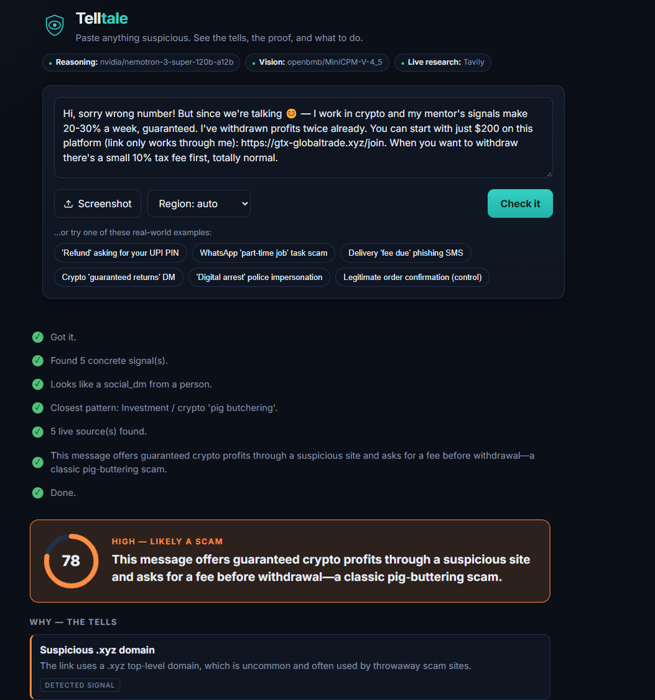

<div align="center">

# 🛡️ Telltale

**Analyze a suspicious message, link, or screenshot and understand the evidence before you click, reply, or send money.**

### The model reasons. Evidence decides.

Reasoning: **NVIDIA Nemotron** via **Nebius Token Factory** · Live verification: **Tavily**

**Live demo:** https://telltale-jawt.onrender.com

*Built during the 2026 Nebius × NVIDIA Global AI Hackathon.*

</div>

---

## Overview

Telltale is a scam-analysis tool for the moment a person is unsure whether a message is legitimate.

You paste a message, upload a screenshot, or provide a link. Telltale analyzes it and returns:

* A **risk score** from 0–100 with a plain-language classification.
* The **specific signals** that contributed to the result.
* The relevant **scam pattern / archetype**, with a cited source.
* An **action plan** — what to do, what not to do, and how to verify the claim through an official channel.
* **Reporting information** for your region (e.g., India's 1930 helpline).
* A suggested **safe reply** when replying makes sense.

It reads messages in multiple languages and presents the analysis in English.



*Above: the live app running on NVIDIA Nemotron + Tavily, catching a crypto "pig-butchering" scam.*

---

## Why this is more than an LLM prompt

Scam detection is a case where a confident but **wrong** answer is worse than no answer — an assistant should never invent a government reporting number, call a domain malicious without checking, or quote a rule it hasn't verified. So Telltale separates **detection, reasoning, evidence, and verification.**

### 1. Deterministic signals

A layer of plain code-based detectors looks for concrete, checkable things:

* Look-alike / homoglyph domains (e.g. `paypa1.com` → `paypal.com`)
* Brand names used in unrelated subdomains
* Gift-card, crypto, wire-transfer and UPI payment demands
* Requests for OTPs, PINs, passwords, or remote-access apps
* Urgency and threat language
* Suspicious URLs, phone numbers and other entities

These signals are individually testable, and they set a **risk floor** — the model cannot push the final result below the risk the hard evidence already justifies.

### 2. Curated knowledge base

Scam archetypes, reporting channels, brand data and citations live in editable data files under [`backend/knowledge/data`](backend/knowledge/data). The model may *select* the right entry, but it never generates a helpline number or a citation from memory. **Adding a new scam type or a new country's reporting info is a data edit (YAML), not a code change** — that's what keeps coverage easy to extend and every cited fact reviewable.

### 3. Nemotron reasoning

NVIDIA Nemotron handles the parts that need interpretation, each with structured (JSON-schema) output:

* Message understanding / entity extraction (Nemotron Nano)
* Scam classification (Nemotron Super)
* Evidence-aware verdict synthesis (Nemotron Super)
* User-facing recommendations (Nemotron Super)

Screenshots are transcribed by a vision-language model (`openbmb/MiniCPM-V-4_5`), since Token Factory doesn't currently expose a Nemotron vision model — every step that actually decides the verdict runs on Nemotron.

### 4. Live verification with Tavily

When a message contains something checkable — an unfamiliar domain, a phone number, a UPI ID, or a named platform — Telltale runs a live Tavily search with year-aware queries so recent reports rank first. Results become **cited evidence** the verdict can point to; a search result is never treated as automatic proof.

### 5. Post-generation verification — shown, not hidden

The model's output is passed through [`backend/verify.py`](backend/verify.py), which **drops any claim it can't back**: a signal that wasn't actually produced, a citation Tavily didn't return, or a "quote" that doesn't appear in the original message. The model is not treated as the source of truth.

And this isn't buried in a log. Every result carries an **evidence audit** — how many findings the model proposed, how many were backed by evidence, and how many were rejected — and the UI renders the rejected ones with the reason each was dropped (*"the reasoning model proposed this; the evidence layer couldn't back it"*). Being able to watch the system overrule its own model, in plain sight, is the clearest proof that the safety layer is real and not decoration.

---

## Risk scoring

The final score combines the deterministic signals with the model's classification and the available evidence. The deterministic layer sets a minimum, so the language model can't be "talked out of" evidence that's already been detected. At the same time, Telltale doesn't claim certainty it hasn't earned — with no Tavily key, for example, it says live reputation wasn't checked rather than presenting an unverified guess as fact.

---

## Models & infrastructure

All reasoning runs on **NVIDIA Nemotron on Nebius Token Factory**:

| Stage                 | Model                                   | Purpose                        |
| --------------------- | --------------------------------------- | ------------------------------ |
| Screenshot OCR        | `openbmb/MiniCPM-V-4_5`                 | Vision / text extraction       |
| Message understanding | `nvidia/NVIDIA-Nemotron-3-Nano-30B-A3B` | Fast structured extraction     |
| Scam classification   | `nvidia/nemotron-3-super-120b-a12b`     | Reasoning over scam archetypes |
| Verdict synthesis     | `nvidia/nemotron-3-super-120b-a12b`     | Combining signals and evidence |
| Recommendations       | `nvidia/nemotron-3-super-120b-a12b`     | Practical next steps           |

Model IDs are configurable via environment variables (see [`backend/config.py`](backend/config.py)); these defaults are what the app calls at runtime. The Nano/Super split keeps everyday calls fast and cheap while reserving the larger model for the reasoning-heavy steps. All model calls go to Token Factory's OpenAI-compatible endpoint (`https://api.tokenfactory.nebius.com/v1/`).

---

## How it meets the hackathon requirements

* **Runs on Nebius Token Factory** — every reasoning step is a runtime call to the Token Factory inference API ([`backend/llm.py`](backend/llm.py)).
* **Uses an NVIDIA open-source model** — NVIDIA Nemotron 3 (Nano + Super) throughout.
* **Functional Tavily call** — live searches during verification ([`backend/tavily.py`](backend/tavily.py)); Tavily is optional in local dev, and the app says so when it's absent.
* **Open source** — MIT, visible at the repo root.

---

## Evaluation

A small, hand-authored labelled set (24 examples: 16 scams across the common archetypes, 8 legitimate controls) is checked two ways — both reproducible with no API key:

```bash
python eval/run_eval.py     # detection metrics
python eval/grounding.py    # evidence-grounding metrics
pytest                      # 33 unit tests
```

Deterministic mode (model off) currently measures:

| Metric | Value |
|--------|-------|
| Precision | **100%** |
| False-positive rate | **0%** — never flags a legitimate message |
| Recall | 75% — the subtle, semantic scams are what the model lifts |
| Unsupported-claim rejection | **100%** — 6/6 fabricated tells dropped |

Full method, numbers, and honest limitations are in [`docs/EVALUATION.md`](docs/EVALUATION.md). The set is intentionally small — read these as regression signals, not real-world accuracy. The tests in [`tests/test_verify.py`](tests/test_verify.py) are the important ones: they prove the model can't slip an unsupported claim past the verifier, or push the score below the hard evidence.

---

## Architecture

```text
                 User input
                     │
          ┌──────────┴──────────┐
          │                     │
       Message              Screenshot
          │                     │
          │              MiniCPM-V (vision)
          │                     │
          └──────────┬──────────┘
                     │
             Entity extraction
                     │
          ┌──────────┴──────────┐
          │                     │
   Deterministic detectors   Nemotron
          │                  reasoning
          │                     │
          └──────────┬──────────┘
                     │
              Scam classification
                     │
              Knowledge base
                     │
                Tavily search
                (if needed)
                     │
                     ▼
              Verdict synthesis
                     │
                     ▼
                 Verifier
                     │
                     ▼
          Verdict + evidence + next actions
```

The model, detectors, knowledge base and verifier are separate components so each can be tested on its own. Deeper write-ups: [`docs/ARCHITECTURE.md`](docs/ARCHITECTURE.md) and [`docs/THREAT_MODEL.md`](docs/THREAT_MODEL.md).

---

## Project structure

```text
backend/
  app.py            FastAPI app: SSE streaming + API endpoints, serves the frontend
  pipeline.py       Analysis pipeline (with deterministic fallbacks)
  llm.py            Nemotron client, structured-output handling
  tavily.py         Tavily live verification
  detectors/        Deterministic detection logic
  knowledge/        Curated scam, reporting and brand data (YAML)
  verify.py         Evidence validation and score reconciliation
  prompts.py        Prompt construction
  schemas.py        Typed contracts for each pipeline stage
  samples.py        Example inputs (+ one legitimate control)
frontend/           Single-page analysis interface
eval/               Evaluation scripts (detection + evidence grounding)
tests/              Unit + verification tests
docs/               Architecture, evaluation and threat-model notes
```

---

## Running locally

```bash
# 1. install
pip install -r requirements.txt

# 2. add your keys
cp .env.example .env
#   NEBIUS_API_KEY  (required)  -> https://tokenfactory.nebius.com
#   TAVILY_API_KEY  (optional)  -> https://tavily.com

# 3. run
uvicorn backend.app:app
#   open http://127.0.0.1:8000
```

### Docker

```bash
docker build -t telltale .
docker run -p 8000:8000 --env-file .env telltale
```

It's a single container, so it deploys anywhere that runs Docker (it's live on Render at the URL up top). The two keys are supplied as environment variables on the host.

---

## Deterministic mode

With no API keys, Telltale still runs — using the deterministic detectors and the knowledge base only — and the UI clearly marks that model reasoning and live verification weren't used. This makes it possible to exercise and test the safety layer independently of the model.

---

## Limitations

* Reporting coverage is strongest for India, the US, UK, Australia, Canada and Singapore; other countries fall back to general safety guidance.
* The brand / look-alike list is intentionally partial.
* The evaluation set is small and not representative of real-world scam prevalence.
* Live web results change and are treated as supporting evidence, not proof.
* Telltale is a safety aid, not legal or financial advice — when money or personal data is involved, verify through an official channel you find yourself.

---

## Roadmap

* A browser extension and a WhatsApp/SMS share-target.
* Broader country-specific reporting and brand data.
* A larger anonymized evaluation set of real scam patterns.
* Voice-call transcription for phone scams.

---

## License

MIT — see [`LICENSE`](LICENSE).
